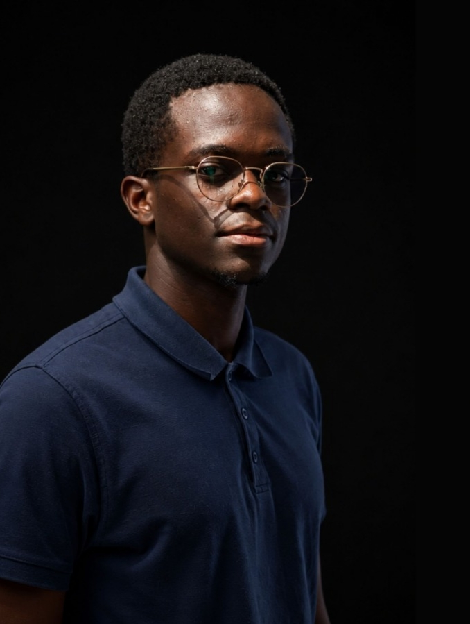

<table>
<tr>

<td width="30%" align="center" valign="middle">



</td>

<td width="70%" valign="middle">

# BERNARD ABUTO

### Machine Learning Research Engineer · AI Systems Engineer

**African Language AI · Machine Learning Systems · Research Engineering**

I work at the intersection of machine learning research and systems engineering,<br>
developing the infrastructure, models, and tools needed to build AI technologies<br>
for African languages and real-world challenges.

</td>

</tr>
</table>
<p>
  <a href="https://github.com/benardabuto081">
    
  </a>
  <a href="https://www.linkedin.com/in/bernard-abuto-888207343/">
    
  </a>
  <a href="https://bernard-portfolio-vert.vercel.app">
    
  </a>
</p>

</div>

---

## 01 — Research & Engineering

I build **machine learning systems and research infrastructure** at the intersection of **AI systems engineering, African language technology, and applied machine learning**.

My work focuses on taking problems from **data and research questions through experimentation, engineering, evaluation, and eventually usable AI systems**.

I am particularly interested in the challenges of building AI for **African languages and African environments** — where limited data, linguistic diversity, infrastructure constraints, and real-world deployment conditions create research problems of their own.

Currently pursuing my degree at the **Open University of Kenya** while building research and engineering experience through hands-on work.

---

## 02 — What I'm Building

<table>
<tr>
<td width="50%" valign="top">

### Sauti Labs

**African Speech & Language Technology**

I am building **Sauti Labs** as an African AI research and technology organisation focused on speech, language, and machine learning systems.

The platform brings together:

`Language Data`
`Speech & Audio`
`Language AI`
`Machine Learning`
`Model Development`
`Research & Evaluation`
`AI Infrastructure`
`AI Products`

Current technical work spans the foundations required to build African-language AI systems — from language resources and data infrastructure through model development, evaluation, inference, and research.

**Role:** Founder · CEO · Chief Research Officer

→ [Explore Sauti Labs](https://github.com/Sauti-Labs)

</td>

<td width="50%" valign="top">

### QueleaGuard

**Applied Machine Learning Research**

QueleaGuard is my current research project investigating **Red-billed Quelea occurrence and habitat suitability in rice-growing landscapes in western Kenya**.

The work combines environmental, climatic, vegetation, terrain, hydrological, and agricultural data to study the spatial conditions associated with quelea occurrence.

Current research areas include:

`Geospatial Data`
`Environmental Modelling`
`Spatial ML`
`Remote Sensing`
`Agricultural Intelligence`

→ [Explore QueleaGuard](https://github.com/benardabuto081/Queleaguard)

</td>
</tr>
</table>

---

## 03 — Research Interests

### African Language AI

Researching the machine learning problems surrounding African speech and language:

* Low-resource and multilingual NLP
* Automatic Speech Recognition
* Text-to-Speech and speech technologies
* African-language datasets and benchmarks
* Language model adaptation
* Model evaluation for African languages
* Speech and language resources for underrepresented languages

### Machine Learning Systems

Interested in the engineering layer that makes ML research reproducible and usable:

* Data and dataset engineering
* ML experimentation
* Training infrastructure
* Evaluation and benchmarking
* Model adaptation and inference
* Reproducible research workflows
* Research-to-system engineering

### Applied Machine Learning

Using machine learning to investigate problems grounded in the physical world:

* Geospatial machine learning
* Environmental modelling
* Remote sensing
* Agricultural intelligence
* Spatial and temporal data

---

## 04 — Engineering

### Languages

<p>
  
  
  
  
  
</p>

### Systems & Infrastructure

<p>
  
  
  
  
</p>

### ML & Data

<p>
  
  
  
</p>

### Application Engineering

<p>
  
  
</p>

---

## 05 — How I Think About ML Systems

```text
                DATA
                  │
                  ▼
        ┌──────────────────┐
        │ Research Question │
        └────────┬─────────┘
                 │
                 ▼
        ┌──────────────────┐
        │ Experimentation  │
        └────────┬─────────┘
                 │
                 ▼
              MODEL
                 │
                 ▼
        ┌──────────────────┐
        │    Evaluation    │
        └────────┬─────────┘
                 │
                 ▼
             SYSTEM
                 │
                 ▼
        ┌──────────────────┐
        │ Real-world Use   │
        └──────────────────┘
```

I am interested in the engineering problems **between research and deployment** — building the data, experimentation, evaluation, infrastructure, and software required to make machine learning research reproducible and useful.

---

## 06 — Current Direction

My long-term direction is **machine learning research engineering and AI systems**.

I want to work where:

**machine learning research**
meets
**systems engineering**
meets
**real-world problems**.

A major part of that direction is contributing to the development of **African AI technologies, research datasets, benchmarks, models, and open technical infrastructure**.

---

## 08 — Connect

If you're working on **African language AI, machine learning research, research software, AI systems, or applied ML**, I'd be interested in connecting.

<p>
  <a href="https://www.linkedin.com/in/bernard-abuto-888207343/">
    
  </a>
  <a href="https://bernard-portfolio-vert.vercel.app">
    
  </a>
</p>

---

<div align="center">

**Researching intelligence · Engineering systems · Building for Africa**

</div>
